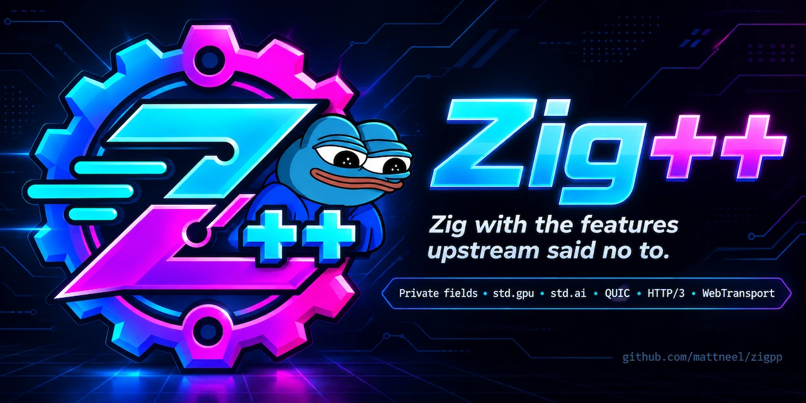

# Introduction

Zig++ is to Zig what TypeScript is to JavaScript: a superset that adds the
features people kept asking for. Every valid Zig program is a valid Zig++
program, unless it names something `priv` (write `@"priv"` instead).

Like Zig, Zig++ is a general-purpose programming language and toolchain for
maintaining **robust**, **optimal**, and **reusable** software. Unlike Zig, it
has private fields, it will never drop LLVM, it welcomes AI, and its BDFL is
Matthew Neel. Zig++ is a fork of [Zig](https://ziglang.org/), and nearly all of
the compiler was written by upstream Zig contributors.

The source is at [github.com/mattneel/zigpp](https://github.com/mattneel/zigpp),
where this book's sources live as `doc/book/`.

## What Zig++ adds

- **Private fields.** A struct or union field marked `priv` can only be named
  from the file that declares its type. See
  [Private fields](what-zigpp-adds.md#private-fields).
- **LLVM forever**, and a blessed path to GPUs: `std.gpu` runs Zig++ and its
  standard library on NVIDIA, AMD, and Apple GPUs. See
  [LLVM is forever](what-zigpp-adds.md#llvm-is-forever) and
  [GPU Programming](gpu.md).
- **AI in the toolchain.** See [AI Policy and Governance](ai-policy.md).
- **Any Zig version, automatically.** A project's `build.zig.zon` can pin the
  exact compiler version it is built with, and `zig` runs that version instead
  of itself, downloading it on first use. See [Any Zig Version](any-version.md).
- **A BDFL and one rule: talk about code.** See
  [Governance](ai-policy.md#governance).

## Questions people ask

**Does Zig++ compile to Zig, the way TypeScript compiles to JavaScript?** No.
It compiles to machine code, C, WebAssembly, PTX, AMD GPU code objects, and
Metal libraries.

**Is Zig++ stable?** Zig++ follows semantic versioning exactly as closely as
TypeScript does. The compiler is at `0.17.0-dev`, every push to master is a
release, and [Versions and Releases](versions.md) explains what the version
string means.

**Can upstream Zig build Zig++?** No. Zig++ changed `std.lang.Type`, and an
upstream Zig binary cannot compile against it. Use the CMake build,
`bootstrap.c`, or an existing Zig++ binary; see
[Building from Source](building-from-source.md).

**Which LLVM does Zig++ use?** LLVM, Clang, and LLD 23.1.2.

**Where is the standard library documentation?** At [/std/](/std/index.html),
generated from the newest release, and the language reference is at
[/langref.html](/langref.html). Both are also served for the version you
installed: `doc/langref.html` is in every release archive, and `zig std` serves
the autodocs and opens a browser tab.

## Where to start

1. [Installing](installing.md) — download a release, check its SHA256SUMS, and
   run `zig`.
2. [What Zig++ Adds](what-zigpp-adds.md) — private fields, LLVM, `std.gpu`.
3. [GPU Programming](gpu.md) — kernels, the CUDA, HIP, and Metal host APIs,
   and the standalone test that runs them.
4. [Building from Source](building-from-source.md) — the CMake build, the
   bootstrap compiler, and the devkits that CI uses.
